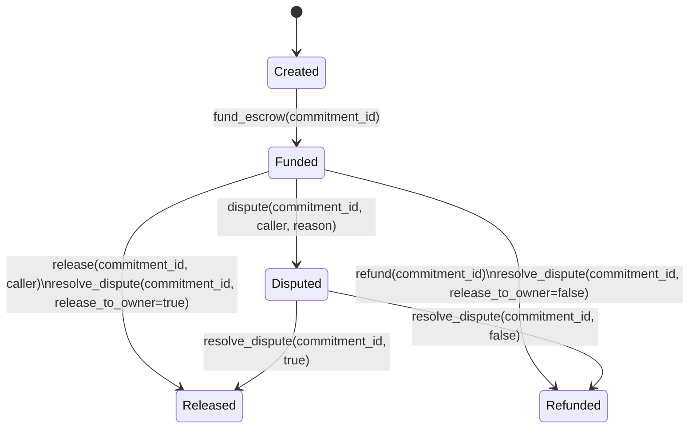

# CommitLabs Soroban Contracts

Soroban (Rust) smart-contract workspace backing the CommitLabs liquidity
commitment protocol. The frontend and Next.js backend service layer
(`src/lib/backend/services/contracts.ts`) interact with these contracts via the
Stellar Soroban RPC.

## Workspace layout

```
contracts/
├── Cargo.toml          # Cargo workspace (members = ["escrow"])
└── escrow/
    ├── Cargo.toml      # commitlabs-escrow crate (cdylib + rlib)
    └── src/
        ├── lib.rs      # EscrowContract implementation
        └── test.rs     # Unit tests (cfg(test))
```

## `escrow` contract

The escrow contract manages the on-chain lifecycle of a liquidity commitment.
Assets are deposited under a chosen risk profile and held in escrow until the
commitment matures, is exited early, or is disputed.

### Lifecycle

```
create_commitment ──► fund_escrow ──► release            (matured: principal back to owner)
                                  └──► refund             (early exit: principal − penalty)
                                  └──► dispute ──► resolve_dispute   (admin adjudication)
```

### Public functions

| Function | Description |
| --- | --- |
| `initialize(admin, token, fee_recipient)` | One-time setup of admin, escrow token (SAC) and penalty fee recipient. |
| `create_commitment(owner, asset, amount, risk, duration_days, penalty_bps)` | Create an unfunded commitment; returns its `id`. |
| `fund_escrow(commitment_id)` | Transfer `amount` from owner into the contract (`Created → Funded`). |
| `release(commitment_id, caller)` | Return principal to owner once matured (`Funded → Released`). |
| `refund(commitment_id)` | Early-exit refund of principal minus `penalty_bps` (`Funded → Refunded`). |
| `dispute(commitment_id, caller, reason)` | Freeze a funded commitment pending admin resolution. |
| `resolve_dispute(commitment_id, release_to_owner)` | Admin-only settlement of a disputed commitment. |
| `record_attestation(commitment_id, attestor, compliance_score)` | Record a 0–100 compliance score. |
| `get_commitment(commitment_id)` | Read a single commitment record. |
| `get_owner_commitments(owner)` | List commitment ids owned by an address. |

### Risk profiles & penalties

`RiskProfile` is `Safe | Balanced | Aggressive`, matching the frontend
`CommitmentType`. The early-exit penalty is supplied at creation time in basis
points (`penalty_bps`, max `10_000`) and is paid to the configured fee
recipient on `refund` / adverse `resolve_dispute`.

### Errors

Stable numeric error codes (`#[contracterror]`) are surfaced so the backend
`normalizeContractError` mapper can translate them into HTTP responses:
`AlreadyInitialized`, `NotInitialized`, `NotFound`, `Unauthorized`,
`InvalidAmount`, `InvalidState`, `NotMatured`, `InvalidDuration`,
`PenaltyTooHigh`.

#### Error codes (stable)

| Variant | Numeric code |
| --- | ---: |
| `AlreadyInitialized` | 1 |
| `NotInitialized` | 2 |
| `NotFound` | 3 |
| `Unauthorized` | 4 |
| `InvalidAmount` | 5 |
| `InvalidState` | 6 |
| `NotMatured` | 7 |
| `InvalidDuration` | 8 |
| `PenaltyTooHigh` | 9 |


### Escrow state machine

The following state machine documents `EscrowStatus` transitions and the
entrypoints that cause them. Use this to reason about lifecycle guarantees
in `contracts/escrow/src/lib.rs`.



#### State transitions (compact)

- `Created` -> `Funded`: `fund_escrow(commitment_id)` — authorized: *owner*.
- `Funded` -> `Released`: `release(commitment_id, caller)` — authorized: *any authenticated caller* (must pass ledger maturity); or `resolve_dispute(..., true)` — *admin*.
- `Funded` -> `Refunded`: `refund(commitment_id)` — authorized: *owner*; or `resolve_dispute(..., false)` — *admin*.
- `Funded` -> `Disputed`: `dispute(commitment_id, caller, reason)` — authorized: *owner* or *admin*.
- `Disputed` -> `Released` / `Refunded`: `resolve_dispute(commitment_id, release_to_owner)` — authorized: *admin*.

### Authorization matrix

| Entrypoint | Admin | Owner | Attestor | Any (authenticated) | Notes / Error codes |
| --- | ---: | ---: | ---: | ---: | --- |
| `initialize(admin, token, fee_recipient)` | yes (signs as `admin`) | no | no | no | Errors: `AlreadyInitialized` |
| `create_commitment(owner, asset, amount, risk, duration_days, penalty_bps)` | no | yes (must sign as `owner`) | no | no | Errors: `NotInitialized`, `InvalidAmount`, `InvalidDuration`, `PenaltyTooHigh` |
| `fund_escrow(commitment_id)` | no | yes (must sign as stored `owner`) | no | no | Errors: `NotInitialized`, `NotFound`, `InvalidState` |
| `release(commitment_id, caller)` | no | no (owner needn't be caller) | no | yes (any signer allowed) | Errors: `NotInitialized`, `NotFound`, `InvalidState`, `NotMatured` |
| `refund(commitment_id)` | no | yes (must sign as `owner`) | no | no | Errors: `NotInitialized`, `NotFound`, `InvalidState` |
| `dispute(commitment_id, caller, reason)` | yes (admin allowed) | yes (owner allowed) | no | no | Errors: `NotInitialized`, `NotFound`, `Unauthorized`, `InvalidState` |
| `resolve_dispute(commitment_id, release_to_owner)` | yes (must sign as `admin`) | no | no | no | Errors: `NotInitialized`, `NotFound`, `InvalidState` |
| `record_attestation(commitment_id, attestor, compliance_score)` | no | no | yes (attestor must sign) | no | Errors: `NotInitialized`, `NotFound` |
| `get_commitment(commitment_id)` | read-only | read-only | read-only | read-only | Errors: `NotFound` |
| `get_owner_commitments(owner)` | read-only | read-only | read-only | read-only | Returns empty list if none |

### Contract error cross-reference

The stable `#[contracterror]` variants used by the contract are referenced
above per-entrypoint. Keep this list in sync with `contracts/escrow/src/lib.rs`.

### Doc-consistency / tests

Unit tests that exercise the lifecycle and authorization expectations live in
[contracts/escrow/src/test.rs](contracts/escrow/src/test.rs#L1-L200). When updating
the contract logic, update these tests and this README to keep behavior and
documentation aligned.

## Build & test

Requires the `stellar` CLI (v23) and the `wasm32v1-none` / `wasm32-unknown-unknown`
target.

```bash
# from contracts/
cargo test            # run unit tests in escrow/src/test.rs
stellar contract build
```

> Note: this workspace is scaffolded to ground the contract issue backlog.
> Verify a local toolchain before deploying to testnet/mainnet.
